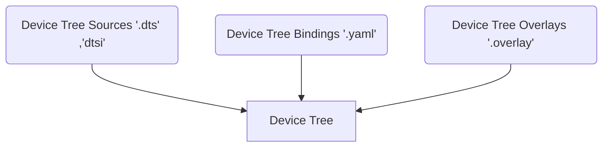

# Device Tree:

The devicetree is a hierarchical data structure that describes the hardware components of a system, including microprocessors, memories, and peripherals.
It is written in a text file format and is used as an input file for the Zephyr build system.

Unlike the linux device tree which compiles to a dtb (device tree blob) the zephyr device tree compiler compiles the device tree to a source header files.The build system uses devicetree sources and 
bindings to produce a generated C header. The generated header’s contents are abstracted by the devicetree.h API, which you can use to get information from your devicetree.

Format:
```
/dts-v1/;

/ {
        a-node {
                subnode_nodelabel: a-sub-node {
                        foo = <3>;
                };
        };
};
```

`/dts-v1/` -> Indicates the device tree version used.

`/` -> The root node of the device treee.

`a-node` -> The first node in the root node.

`subnode_nodelabel: a-sub-node` -> A sub node within `a-node`  with a node label `a-sub-node`.

`foo = <3>` -> Node a-sub-node has a property named foo, whose value is a cell with value 3. The size and type of foo‘s value are implied
by the enclosing angle brackets (< and >) in the DTS.


These are the three components which are used to produce the final device tree source.


### Device Tree Sources:

The information in a device tree comes from sources such as hardware specifications and board schematics. Mostly the board vendor provides these files.

### Device Tree Bindings:

A devicetree binding declares requirements on the contents of nodes, and provides semantic information about the contents of valid nodes.
Zephyr devicetree bindings are YAML files in a custom format (Zephyr does not use the dt-schema tools used by the Linux kernel).

### Device Tree Overlays:

The Device Tree Source files can be extended or modified using overlays. Overlays are also DTS files; the .overlay extension is just a
convention which makes their purpose clear. Overlays adapt the base devicetree for different purposes.


